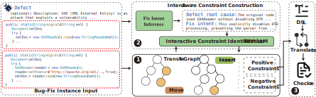

# DSLGEN: Extracting Bug Patterns from Bug-Fix Examples

## 📝 Overview
This repository contains the implementation of **DSLGEN**,  
a framework for automatically constructing generalizable bug patterns from concrete buggy-fix code examples.  
The extracted patterns are expressed in a domain-specific language (DSL),  
enabling precise and compact pattern-based analysis.

<p align="center">
  
</p>

## 📂 Repository Structure

```text
DSLGEN/
├── 01pattern/              # Intermediate results about transfer-graph-based pattern
├── 02pattern-info/         # Intermediate results about Metadata for patterns and LLM's result
├── 06config/
│   └── config.yml          # Configuration file
├── 07dsl/                  # Extracted DSL schema
├── 08example/              # Example input-output cases
├── 09appendix/             # Supplementary materials (e.g., User Study)
│
├── ModifiedMetaModel/      # Java implementation of core framework
│   ├── repair.ast/         # AST node modeling and traversal
│   ├── repair.dsl/         # DSL query translation
│   ├── repair.pattern/     # Transfer-graph
│   └── repair.main/        # Entry
│
├── script/
│   ├── app/                # Python implementation of core framework
│   ├── exp/                # Experiment and evaluation scripts
│   └── requirements.txt    # Python dependencies
│
├── Utils/                  # Common utility functions
├── pom.xml                 # Java project build file (Maven)
└── README.md
```

## ⚙️ Environment Setup
1. Java (for transfer graph construction and dsl translation)
    * JDK version: Java 17 recommended
    * Build tool: Maven 3.6+

    To build the Java part:
    ``` bash
    mvn clean install
    ```
   This will generate `ModifiedMetaModel-1.0-SNAPSHOT-runnable.jar` in the `ModifiedMetaModel/artifacts/` directory.

2. Python (for scripting and experiments)
    * Python version: Python 3.11+
   
    Install dependencies:
    ``` bash
    cd script
    pip install -r requirements.txt
    ```
3. Configuration

   All runtime parameters (e.g., LLM endpoint and API key) can be configured in:
    ``` text
    06config/config.yml
    ```
   Please modify this file according to your LLM.

## ▶️ Usage

The full end-to-end pipeline has been integrated into a Python script.
You can run the entire workflow to extract a DSL pattern from a single bug-fix example:

``` bash
cd script
python -m app.pipeline.codepair
    --code_path /path/to/codepair  # e.g., ../08example/code
    --dsl_path /path/to/store/dsl
```
Make sure to configure runtime parameters in `06config/config.yml`


## 🛠️ Development Status

This project is under active development. 
Some components and datasets may be updated after the paper publication.

## 📝 License

This code is currently released for academic review only.

